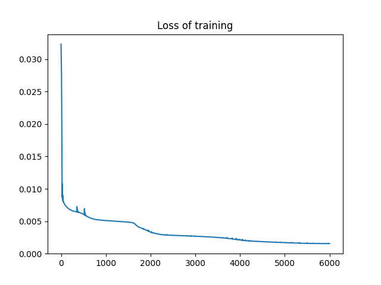
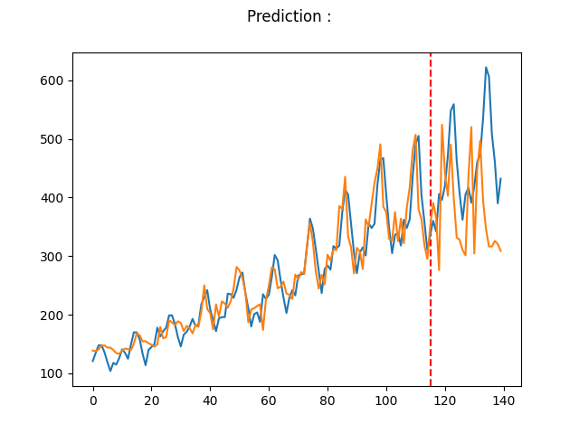

<h2> Description </h2>

L'objectif est de prédire le nombre de passagers dans un aéroport international. Le nombre de passagers est donné en unités de 1000.
La base de données disponible est à partir d'un intervalle de janvier 1949
jusqu'en décembre 1960 avec 144 observations. 

<h2> Modele </h2>

Le modele utilise est constitue d'une couche LSTM suivie d'une couche fully connected. 

<h2> Environnement </h2>

Pytorch

<h2> Faire tourner le projet </h2>
* Installer les dependences : pip install requirements.txt
* Tapez : python main.py

<h2> Courbe du Loss : </h2>

<h2> Resultat de prediction </h2>

